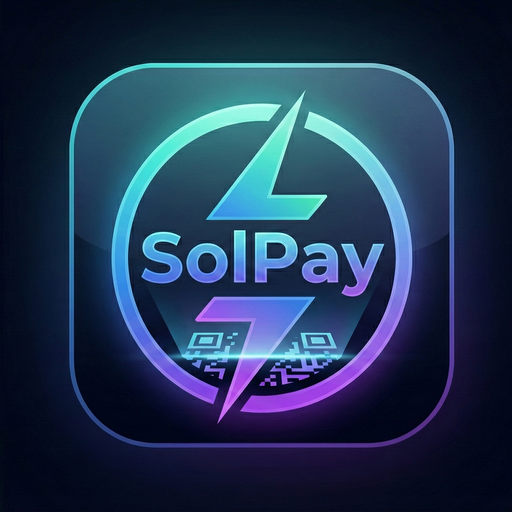

<p align="center">
  
</p>

<h1 align="center">SolPay</h1>

<p align="center">
  <strong>Mobile Payment Application Using Solana Blockchain and USDC Stablecoin</strong>
</p>

<p align="center">
  <a href="#features">Features</a> &nbsp;&bull;&nbsp;
  <a href="#architecture">Architecture</a> &nbsp;&bull;&nbsp;
  <a href="#getting-started">Getting Started</a> &nbsp;&bull;&nbsp;
  <a href="#smart-contract">Smart Contract</a> &nbsp;&bull;&nbsp;
  <a href="#api-reference">API Reference</a> &nbsp;&bull;&nbsp;
  <a href="#license">License</a>
</p>

<p align="center">
  
  
  
  
  
  
</p>

---

SolPay is a merchant-facing mobile payment platform that enables businesses to accept **USDC stablecoin** payments on the **Solana blockchain**. Customers pay by scanning a QR code with any Solana-compatible wallet — no additional app required. Settlements happen in under one second with fees as low as **0.25%**, compared to the 2.5–4% charged by traditional payment processors.

A custom **Clearinghouse smart contract** handles atomic payment processing, tiered fee calculation, and trustless fund splitting using Program Derived Addresses (PDAs). A **privacy pool** mechanism prevents direct on-chain linkage between customer and merchant wallets.

> **Status:** Functional prototype deployed on Solana Devnet. Built as a CSI4900 Honours Project at the University of Ottawa, Winter 2026.

---

## Features

- **Instant Settlement** — Sub-second payment finality via Solana's ~400ms block time
- **Low Fees** — Tiered platform fees from 0.25% to 1.0% (vs. 2.5–4% traditional)
- **Solana Actions & Blinks** — Universal wallet compatibility through the Solana Actions specification
- **Privacy Pool** — Intermediary pool prevents direct customer-to-merchant on-chain linkage
- **Multi-Currency** — Supports EUR, USD, GBP, CAD, JPY with automatic USDC conversion
- **QR Code Payments** — Solana Pay URI-encoded QR codes for tap-and-go checkout
- **Real-Time Dashboard** — Live analytics with daily, weekly, and monthly transaction metrics
- **PIN-Protected Balance** — 6-digit PIN locks sensitive financial data on the merchant device
- **On-Chain Fee Splitting** — Smart contract atomically splits payments between merchant and fee collector
- **No Customer App** — Customers use their existing Solana wallet (Phantom, Solflare, etc.)

---

## Architecture

```
┌─────────────────┐     QR / Blink     ┌─────────────────┐
│  Customer Wallet │ ◄────────────────► │  SolPay Mobile   │
│  (Phantom, etc.) │                    │  App (Flutter)   │
└────────┬────────┘                    └────────┬────────┘
         │  Signs TX                            │  HTTP API
         │                                      │
         ▼                                      ▼
┌─────────────────┐    RPC Calls    ┌──────────────────────┐
│     Solana       │ ◄────────────► │  SolPay Action Server │
│   Blockchain     │                │  (Node.js / Express)  │
└────────┬────────┘                └──────────┬───────────┘
         │                                     │
         ▼                                     ▼
┌─────────────────┐                 ┌─────────────────────┐
│  Clearinghouse   │                │    Privacy Pool      │
│ Smart Contract   │ ◄────────────► │   (PDA Token Acct)   │
│  (Rust/Anchor)   │   CPI Calls   └─────────────────────┘
└─────────────────┘
```

The system is composed of three main components:

| Component | Technology | Directory |
|-----------|-----------|-----------|
| Mobile App | Flutter / Dart | `solpay_app/` |
| Backend Server | Node.js / Express | `solpay_server/` |
| Smart Contract | Rust / Anchor 0.32.1 | `solpay_contract/` |

---

## Getting Started

### Prerequisites

- [Flutter SDK](https://docs.flutter.dev/get-started/install) (3.x+)
- [Node.js](https://nodejs.org/) (18+)
- [Rust](https://www.rust-lang.org/tools/install) & [Anchor CLI](https://www.anchor-lang.com/docs/installation) (0.32.1)
- [Solana CLI](https://docs.solana.com/cli/install-solana-cli-tools)
- Android Studio or Xcode (for mobile emulator)

### 1. Clone the Repository

```bash
git clone https://github.com/davidramalevi/solpay.git
cd solpay
```

### 2. Smart Contract Setup

```bash
cd solpay_contract

# Configure Solana CLI for devnet
solana config set --url devnet

# Build the program
anchor build

# Deploy (see DEPLOYMENT.md for full guide)
anchor deploy
```

### 3. Backend Server Setup

```bash
cd solpay_server

# Install dependencies
npm install

# Configure environment
cp .env.example .env
# Edit .env with your RPC URL, program ID, and key paths

# Start the server
node src/index.js
```

The server runs on `http://localhost:3000` by default.

### 4. Mobile App Setup

```bash
cd solpay_app

# Install Flutter dependencies
flutter pub get

# Run on Android emulator (server must be running)
flutter run
```

> **Note:** The app connects to `http://10.0.2.2:3000` by default (Android emulator localhost). For physical devices, update the base URL in `lib/services/api_service.dart` to your machine's IP address.

---

## Smart Contract

**Program ID:** `FPbAoy16bcjkAQmgrbwzjRA7GsKYEGmZyRBFChhDztXx`

The Clearinghouse program processes payments in a single atomic instruction:

1. **Customer → Pool:** Full USDC amount transferred to the privacy pool
2. **Pool → Merchant:** Amount minus fee forwarded to the merchant's token account
3. **Pool → Fee Collector:** Platform fee sent to the fee collector

### Fee Structure

| Transaction Range | Platform Fee |
|-------------------|-------------|
| $0 – $10 | 1.00% (100 bps) |
| $10 – $50 | 0.75% (75 bps) |
| $50 – $100 | 0.50% (50 bps) |
| $100+ | 0.25% (25 bps) |

Solana network fees are under **$0.001** per transaction.

### Program Accounts

| Account | Type | Description |
|---------|------|-------------|
| `ClearinghouseConfig` | PDA (`seeds: ["config"]`) | Global settings and cumulative statistics |
| `PoolAuthority` | PDA (`seeds: ["pool", config]`) | Signs CPI transfers from the pool |
| `PoolTokenAccount` | ATA | Holds USDC during payment processing |

---

## API Reference

Base URL: `http://localhost:3000`

### Wallet

| Method | Endpoint | Description |
|--------|----------|-------------|
| `POST` | `/api/wallet/create` | Generate new Solana wallet with mnemonic |
| `GET` | `/api/wallet/balance/:address` | Get SOL and USDC balances |
| `POST` | `/api/wallet/airdrop` | Request devnet SOL airdrop |

### Payments

| Method | Endpoint | Description |
|--------|----------|-------------|
| `POST` | `/api/payments/create` | Create payment session with QR data |
| `GET` | `/api/payments/status/:id` | Poll payment status |

### Solana Actions

| Method | Endpoint | Description |
|--------|----------|-------------|
| `GET` | `/api/actions/pay?session=id` | Action metadata (icon, title, amount) |
| `POST` | `/api/actions/pay?session=id` | Returns unsigned transaction for signing |
| `GET` | `/actions.json` | Solana Actions manifest |

### Transactions & Dashboard

| Method | Endpoint | Description |
|--------|----------|-------------|
| `GET` | `/api/transactions/:address` | Transaction history |
| `GET` | `/api/dashboard/:address` | Dashboard statistics |
| `GET` | `/api/health` | Server and RPC health check |

---

## Payment Flow

```
1. Merchant enters amount        →  Mobile App
2. App calls POST /payments      →  Server creates session with unique micro-amount
3. QR code displayed             →  Encodes Solana Pay URI with pool address
4. Customer scans QR             →  Wallet fetches Action metadata (GET)
5. Wallet requests transaction   →  Server builds unsigned TX (POST)
6. Customer signs & submits      →  Transaction lands on-chain
7. Monitor detects payment       →  Matches session by unique amount
8. Server invokes smart contract →  Atomic split: merchant + fee collector
9. Status updated to completed   →  App shows success to merchant
```

---

## Project Structure

```
solpay/
├── solpay_app/                   # Flutter mobile application
│   ├── lib/
│   │   ├── main.dart             # App entry point
│   │   ├── screens/              # 6 screens (login, signup, dashboard, etc.)
│   │   ├── models/               # 7 data models
│   │   ├── services/             # AuthService, ApiService
│   │   ├── widgets/              # 5 reusable UI components
│   │   └── theme/                # Solana-inspired dark theme
│   └── pubspec.yaml
│
├── solpay_server/                # Node.js backend server
│   ├── src/
│   │   ├── index.js              # Express app entry point
│   │   ├── routes/               # API route handlers
│   │   └── services/             # SolanaService, PoolWallet, PaymentMonitor
│   ├── keys/                     # Keypair files (gitignored)
│   └── package.json
│
├── solpay_contract/              # Anchor smart contract
│   ├── programs/
│   │   └── solpay_contract/
│   │       └── src/lib.rs        # Clearinghouse program
│   ├── Anchor.toml
│   └── DEPLOYMENT.md
│
└── images/                       # Branding assets
```

---

## Tech Stack

| Layer | Technology | Purpose |
|-------|-----------|---------|
| Mobile | Flutter / Dart | Cross-platform merchant app |
| State | Provider (ChangeNotifier) | Reactive UI state management |
| Storage | SharedPreferences | Local session persistence |
| Backend | Node.js / Express | API server and payment orchestration |
| Blockchain | Solana (Devnet) | Settlement layer |
| Smart Contract | Rust / Anchor 0.32.1 | On-chain payment processor |
| Token | USDC (SPL Token) | Stablecoin for payments |
| QR | qr_flutter | Solana Pay QR code generation |
| RPC | Shyft | Solana RPC provider |

---

## Environment Variables

Create a `.env` file in `solpay_server/`:

```env
PORT=3000
SOLANA_RPC_URL=https://rpc.shyft.to?api_key=YOUR_KEY
USDC_MINT=YOUR_DEVNET_USDC_MINT
PROGRAM_ID=FPbAoy16bcjkAQmgrbwzjRA7GsKYEGmZyRBFChhDztXx
FEE_COLLECTOR_ADDRESS=YOUR_FEE_COLLECTOR_PUBKEY
SERVER_BASE_URL=http://localhost:3000
```

---

## Documentation

Full technical documentation (30 pages, 13 diagrams) is available in the repository:

- **[Technical Documentation (PDF)](SolPay_Technical_Documentation.pdf)** — System architecture, class diagrams, sequence diagrams, flowcharts, data flow diagrams, state diagrams, ER diagrams, use case diagrams, API documentation, and security analysis.
- **[Deployment Guide](solpay_contract/DEPLOYMENT.md)** — Step-by-step smart contract deployment instructions.

---

## Security

- **PDA Validation** — Config and pool authority use canonical bumps with verified derivation
- **Token Account Constraints** — All accounts validated for correct mint and ownership
- **Fee Collector Lock** — Fee recipient must match the on-chain config
- **Rate Limiting** — Token bucket algorithm (9 req/sec) prevents RPC abuse
- **PIN Protection** — 6-digit PIN guards balance visibility on the merchant device
- **Privacy Pool** — Customer wallets are never exposed to merchants on-chain
- **Safe Arithmetic** — Checked math prevents integer overflow/underflow

---

## Roadmap

- [x] Smart contract development and devnet deployment
- [x] Flutter mobile app with full merchant workflow
- [x] Backend server with Solana Actions compliance
- [x] Privacy pool payment flow
- [x] Technical documentation
- [ ] Professional security audit
- [ ] Mainnet deployment
- [ ] App Store / Play Store release
- [ ] Solana Mobile Wallet Adapter integration
- [ ] On-chain merchant loyalty token system
- [ ] Push notifications (Firebase Cloud Messaging)
- [ ] Multi-language support (i18n)

---

## Contributing

Contributions are welcome! Please open an issue or submit a pull request.

1. Fork the repository
2. Create your feature branch (`git checkout -b feature/amazing-feature`)
3. Commit your changes (`git commit -m 'Add amazing feature'`)
4. Push to the branch (`git push origin feature/amazing-feature`)
5. Open a Pull Request

---

## License

This project is licensed under the MIT License. See [LICENSE](LICENSE) for details.

---

## Acknowledgments

- **University of Ottawa** — CSI4900 Honours Project, Winter 2026
- **Professor Mohamed Ali Ibrahim, Ph.D., P. Eng.** — Project Supervisor
- **Solana Foundation** — Blockchain infrastructure and developer tools
- **Circle** — USDC stablecoin
- **Anchor Framework** — Smart contract development framework

---

<p align="center">
  Built with Solana &nbsp;&#9830;&nbsp; Powered by USDC
</p>
